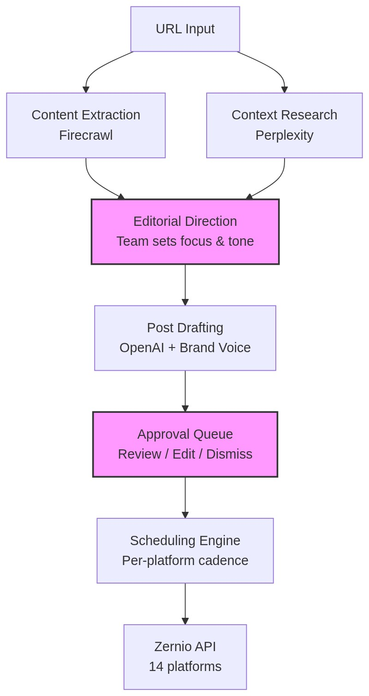
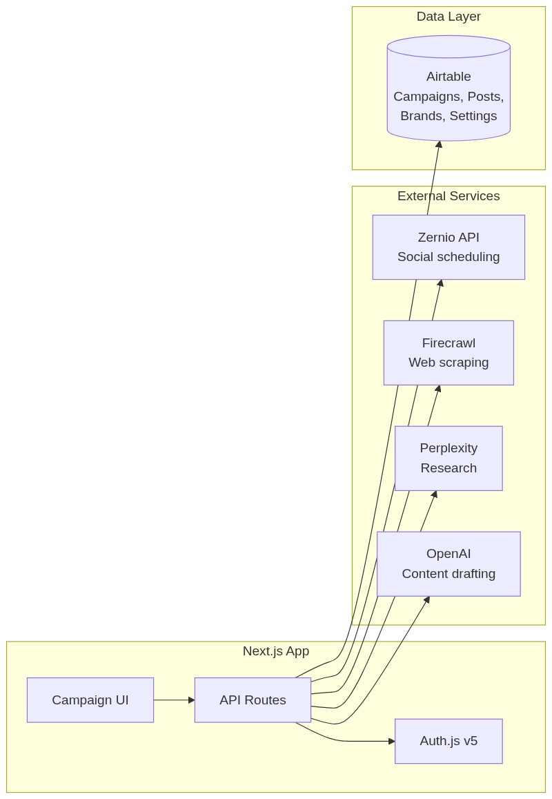
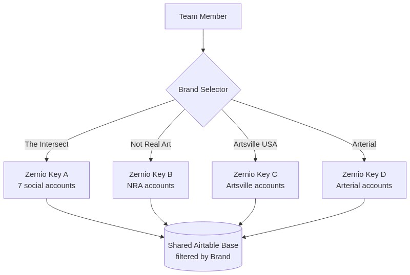

# Getting Started — Development Guide

This document outlines the phased development plan and how to start contributing.

## Quick Start

```bash
cd social-media-promo-scheduler
npm install
# Edit .env.local with your API keys (see .env.example)
npm run dev
# Open http://localhost:3025 → login with your credentials
```

### Credentials (Development)

| Email | Role | Brands | Access |
|-------|------|--------|--------|
| juergen@polymash.com | super-admin | All brands | Full access |
| scottpower@arterial.org | admin | Artsville USA, Not Real Art | Full access to assigned brands |
| editor@notrealart.com | curator | Artsville USA, Not Real Art | Review/approve campaigns |
| kbviking@gmail.com | curator | Not Real Art | Review/approve NRA campaigns |
| elise@example.com | curator | Artsville USA | Review/approve Artsville campaigns |

Password for all: `REDACTED_PASSWORD` (development only)

User-to-brand mapping is in the **Airtable Users table** (`tblyUmt78haC25nPZ`). Changing brand access does not require a redeploy — update the Airtable record and the user's next login picks up the change.

---

## Architecture

### Campaign Pipeline



> The pink nodes are human-in-the-loop steps — the team controls direction and approves everything.

### Data Architecture



### Multi-Brand Switching



---

## Multi-Brand Architecture

The system serves multiple brands from a single Airtable base with brand-level separation:

| Brand | Zernio Profile | Newsletter | Status |
|-------|---------------|------------|--------|
| **The Intersect** | The Intersect High Frequency (`68dd94a97fca0cbc457aa18e`) | theintersect.art (Curated.co) | Active — 7 accounts connected |
| **Not Real Art** | Not Real Art (`69c454e216cdacff1d3d2b76`) | newsletter.notrealart.com (Curated.co) | Active |
| **Artsville USA** | Artsville USA (`69c51f9c09b9b77530306823`) | TBD | Active |
| **Sugar Press Art** | Sugarpress Art (`68ee9d7a7a448663a45de9dc`) | — | Active |
| **Arterial** | — | N/A | Inactive |

Each brand has its own Zernio API key scoped to its profile. Switching brands in the UI swaps the active API key and filters campaigns/posts to that brand. All data lives in a shared Airtable base with a `Brand` field for separation.

### Why Shared Airtable?

- Platform settings (character limits, image sizes, best practices) are universal — no need to duplicate
- Team members work across brands — Kirsten curates NRA exhibitions but also reviews Artsville content
- Campaign analytics benefit from cross-brand comparison
- Simpler infrastructure — one base, one PAT, one schema

### What's Brand-Specific?

- Zernio API key (scoped to profile with its social accounts)
- Brand voice guidelines
- Campaign history
- Editorial direction defaults

---

## Development Phases

### Phase I: Foundation (MVP)

**Goal:** Create one campaign from a newsletter URL, generate posts, approve them, schedule them.

**Starting point:** The Intersect newsletter (theintersect.art) — Juergen's own newsletter with connected Zernio accounts.

| Task | Status | Description |
|------|--------|-------------|
| Airtable base setup | Done | Tables: Campaigns, Posts, Brands, Platform Settings, Image Sizes |
| Campaign creation UI | Done | Form: URL input, brand selector, campaign type, duration preset, editorial direction |
| URL scraping | Done | Firecrawl integration — og:image extraction on campaign creation |
| Calendar day view | Done | Sheet panel with post timeline, day-to-day navigation, platform filter bar |
| Post detail dialog | Done | Platform header, retry for failed posts, expandable text, clickable URLs, PDF media handling |
| Dashboard overview | Done | Stats with configurable time range (today/7d/30d/90d), accurate per-status counts |
| Calendar settings | Done | Week-starts-on-Monday preference in Settings |
| Post generation | Done | Claude Sonnet 4.6 — generate platform-specific post variants using brand voice + platform best practices |
| Per-brand Zernio keys | Done | Brand switcher, per-brand API key resolution, profile filtering (#41) |
| User-brand access | Done | Airtable Users table, session integration, scoped brands API (#42) |
| Connected platform filtering | Done | Generation options show only platforms with connected Zernio accounts |
| Approval queue | Done | List-view approve/dismiss buttons, tab auto-switch after generation, inline editing |
| Basic scheduling | Done | Push approved posts to Zernio API with tapering schedule, collision avoidance |
| Image matching | Done | Unified image catalog (imageIndex), dimension-aware dedup, thumbnail filtering, Image-Text Integrity Rule |
| Generation UX | Done | Compact progress bar, Save Options persistence, unsaved settings warning, editorial direction tips |
| Schedule preview | Done | Campaign timeline heatmap with density visualization (#13) |
| CMS scraping | Done | Ghost excludeTags, event section parsing, supplemental URL entity filtering |
| Image optimization | Done | Client-side compression (timeout guards), server-side Sharp (PNG/WebP→JPEG), Vercel Blob permanent hosting |
| Single-post publish | Done | Publish Now button in post detail, double-publish guard, Zernio Post ID extraction |
| Webhook status sync | Done | Zernio webhook endpoint for post.published/failed/partial → Airtable status update |
| LinkedIn PDF carousel | Done | Auto-assemble multi-image LinkedIn posts into PDF via pdf-lib at publish time (#65) |
| lnk.bio integration | Done | Auto-create link-in-bio entry after Instagram publish (The Intersect, hardcoded — #68 for per-brand) |
| Platform aspect crop | Done | Instagram/Threads max 1.91:1 enforced via center-crop to 16:9 |
| Failed post handling | Done | Retry (reset to Approved, clear Zernio state) and Delete (blob/short.io cleanup) in list + detail views |
| Zernio schedule sync | Done | Sync button on timeline fetches dates/statuses from Zernio → updates Airtable |

**Campaign types for Phase I:**
- Newsletter (Curated.co) — primary development target
- Blog Post / Article — similar pipeline, good for validation

**Not in Phase I:** Per-platform frequency sliders, preset customization, image generation (Orshot), analytics. Multi-brand switching is done (#41). Event campaigns are done (#46).

### Phase II: Scheduling Engine + Multi-Brand

**Goal:** Per-platform tapering schedules, duration presets, distribution slider. Multi-brand support with API key switching.

| Task | Description |
|------|-------------|
| Tapering schedule engine | TypeScript implementation of Missinglettr-inspired exponential curve with per-platform cadence |
| Duration presets | Sprint (2wk), Standard (3mo), Evergreen (6mo), Marathon (12mo), Custom |
| Distribution slider UI | Front-loaded / balanced / back-loaded — live preview of post distribution |
| Per-platform cadence | Platform-specific volume multipliers, time windows, minimum spacing |
| Schedule preview | Visual timeline showing post slots per platform before generation |
| Brand switching | Swap Zernio API key per brand, filter campaigns/posts by brand |
| Additional campaign types | Exhibition, Artist Profile, Podcast Episode |

### Phase III: Rich Content + Collaboration

**Goal:** Image generation, carousel templates, pre-generation input workflow, team collaboration features.

| Task | Description |
|------|-------------|
| Orshot integration | Instagram carousel templates with artwork images |
| Image pipeline | Download, resize per platform, persist, upload to Zernio |
| Pre-generation input | Chatbot or questionnaire asking team members for editorial focus before AI generation |
| Deep artist research | Perplexity integration for artist context beyond the source URL |
| Campaign analytics | Track post performance via Zernio analytics API, feed back into frequency optimization |
| Event campaigns | ~~Time-bounded campaigns that end on event date~~ Done in Phase I (#46) |
| Public art (Remote) | Location-based campaign type |
| Institutional (Arterial) | Mission-driven content campaigns |

### Phase IV: Optimization + Scale

**Goal:** Analytics-driven optimization, automated campaign triggers, Vercel deployment.

| Task | Description |
|------|-------------|
| Vercel deployment | Production deployment with env vars |
| Automated triggers | n8n webhook or cron that creates campaigns when new content is published |
| A/B content testing | Generate multiple variants, measure performance, learn |
| Cross-campaign awareness | Prevent scheduling conflicts across campaigns on the same platform |
| Best-time optimization | Use Zernio analytics best-time API to adjust posting windows |

---

## Campaign Types (Complete List)

| # | Type | Source | Phase |
|---|------|--------|-------|
| 1 | **Newsletter** | Curated.co URL (theintersect.art, newsletter.notrealart.com) | I |
| 2 | **Blog Post / Article** | Article URL | I |
| 3 | **Exhibition** | Gallery/museum URL | II |
| 4 | **Artist Profile** | Artist page or Q+Art interview URL | II |
| 5 | **Podcast Episode** | Podcast URL (NRA network, Artsville) | II |
| 6 | **Event** | Event page URL | I (done) |
| 7 | **Public Art** | Location/project URL (Remote series) | III |
| 8 | **Video / Film** | Video URL (Arthouse series) | III |
| 9 | **Institutional** | Mission/impact content URL | III |
| 10 | **Custom** | Manual entry | I |

---

## Third-Party Services

This project integrates with multiple external services. All API keys go in `.env.local` (see `.env.example` for the full template).

### Core Services (Phase I)

| Service | Purpose | Cost Model | Config |
|---------|---------|-----------|--------|
| **Zernio** | Social scheduling to 14 platforms | Plan-based (100-150 profiles available) | `LATE_API_KEY` |
| **Auth.js** | Team login (Credentials provider) | Free (self-hosted) | `AUTH_SECRET`, `AUTH_USERS` |
| **Airtable** | Campaign data, posts, brands, settings | Free tier / Plus | `AIRTABLE_API_KEY`, `AIRTABLE_BASE_ID` |
| **Firecrawl** | Web scraping and content extraction | ~$0.01/page | `FIRECRAWL_API_KEY` |
| **Perplexity** | Deep research (artist bios, context) | Plan-based | `PERPLEXITY_API_KEY` |
| **OpenAI** | Content drafting (GPT-4.1) | Pay-per-use | `OPENAI_API_KEY` |

### Analytics & Links (Phase II)

| Service | Purpose | Cost Model | Config |
|---------|---------|-----------|--------|
| **Short.io** | Link shortening + click analytics | Plan-based | `SHORT_IO_API_KEY`, `SHORT_IO_DOMAIN` |
| **LNK.bio** | Link-in-bio pages (Instagram profiles) | Plan-based | `LNKBIO_API_KEY` |

### Visual Content (Phase III)

| Service | Purpose | Cost Model | Config |
|---------|---------|-----------|--------|
| **Replicate** | Image generation (Flux Schnell/Dev) | Pay-per-use | `REPLICATE_API_TOKEN` |
| **Blotato** | Carousel and visual content creation | TBD | `BLOTATO_API_KEY` |
| **Orshot** | Instagram carousel templates | TBD | `ORSHOT_API_KEY` |

### Hosting

| Service | Purpose | Cost Model |
|---------|---------|-----------|
| **Vercel** | App hosting and deployment | Free tier / Pro |

### Infrastructure Notes

- All services are currently on Juergen's accounts. Cost charge-back to Arterial/NRA is TBD (see issue #16).
- Each brand's Zernio API key is scoped to its profile — one key per brand.
- Short.io may need custom short domains per brand (e.g., nra.link, artsville.link).
- Short.io and Zernio both provide analytics — click tracking and post engagement respectively.

---

## Background Knowledge

All reference documents are in `docs/background/`:

| Document | Contents |
|----------|----------|
| [brand-profiles.md](docs/background/brand-profiles.md) | Arterial, Not Real Art, Artsville USA — missions, content series, voices |
| [missinglettr-scheduling-reference.md](docs/background/missinglettr-scheduling-reference.md) | Tapering curve, slider UI, duration presets |
| [posting-slots-rules.md](docs/background/posting-slots-rules.md) | Per-platform time windows, spacing, volumes |
| [firecrawl-reference.md](docs/background/firecrawl-reference.md) | API endpoints, scraping patterns, gotchas |

---

## GitHub Issues

Design discussions happen in GitHub Issues:

- **#1** — Per-platform tapering schedule engine
- **#2** — Campaign creation and types
- **#3** — Approval queue and post review
- **#4** — Brand voice and editorial direction
- **#5** — Airtable schema and data architecture
- **#6** — Requirements gathering and user stories
- **#7** — Design inbox (unstructured ideas)
